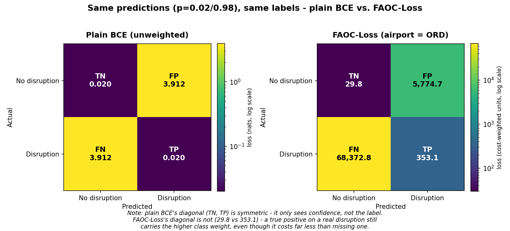

# FAOC-Loss: validation results and explanation

This document validates `faoc_loss.py` against the design it claims to
implement (see that file's docstring and `cost_figures.md`). It is written
for anyone on the team, whether or not you were involved in building this —
you should be able to read this top to bottom and come away trusting (or
correctly distrusting) the loss function without reading the source code.

No model exists yet to test this against real predictions (Phase 2 baselines
aren't built). What follows is a **synthetic validation**: feeding the loss
function known, hand-picked inputs and checking that the output matches what
the math says it should, and only that.

## Why this validation, not a unit test suite

`faoc_loss.py` makes three specific behavioral claims:

1. It penalizes a missed disruption (false negative) more than a false
   alarm (false positive).
2. That false-negative penalty scales by *how bad a place to miss it is* —
   the airport's delay propagation multiplier (`delay_propagation_
   multipliers.csv`) — while a false alarm's penalty does not.
3. Airports with no multiplier on file fall back to the national composite
   (1.51) rather than erroring or silently defaulting to something else.

Each of these is a claim about *relationships between numbers*, not a single
correct output value — there's no ground truth "the loss for this input
should be exactly 68,372.8." So the right way to check it is to construct
inputs where we know what the *relationship* between outputs should be, and
confirm it holds. That's what the scenarios below do.

## How to reproduce this

```bash
cd nas_project
python -m losses.validate_faoc_loss
```

`validate_faoc_loss.py` runs `FAOCLoss` (with its default settings — no
tuning or cherry-picking) against a fixed set of hand-picked inputs, and
prints each one next to what plain (unweighted) binary cross-entropy would
have said about the same input. The comparison to plain BCE matters because
it isolates *how much extra weight* FAOC-Loss is adding — the `ratio` column
below is `FAOC-Loss ÷ plain BCE` for that exact same prediction.

## What the numbers below mean, if you're new to this

- **`p`** — the model's predicted probability that a disruption happens
  (0 = certain no, 1 = certain yes). These are fabricated, confident values
  chosen to make the scenarios easy to reason about, not real model output.
- **`y`** — the true label (0 = no disruption happened, 1 = one did).
- **`DM`** — that airport's delay propagation multiplier (how much a
  minute of delay there cascades system-wide; see `cost_figures.md` §3).
- **`FAOC`** — the loss value `faoc_loss.py` produces for that `(p, y,
  airport)` triple. Bigger number = the model gets penalized harder for
  this mistake during training.
- **`plainBCE`** — what a standard, un-weighted cross-entropy loss would
  have produced for the identical `p` and `y`. This is the baseline every
  other tier's model is training against — it treats every mistake as
  equally costly.
- **`ratio`** — `FAOC ÷ plainBCE`. This is the number that actually matters:
  it says "FAOC-Loss is treating this specific mistake as N times more (or
  less) costly than a standard loss would."

## Results

### 1. Confusion-matrix corners, fixed airport (ORD)

The same four basic outcomes (confidently right or wrong, for each label),
all at one airport, so airport effects can't confuse the comparison yet.

```
True negative (confident)   p=0.02 y=0  DM=1.48  FAOC=      29.8  plainBCE=0.020  ratio=  1,476.1x
False positive (confident)  p=0.98 y=0  DM=1.48  FAOC=   5,774.7  plainBCE=3.912  ratio=  1,476.2x
False negative (confident)  p=0.02 y=1  DM=1.48  FAOC=  68,372.8  plainBCE=3.912  ratio= 17,477.6x
True positive (confident)   p=0.98 y=1  DM=1.48  FAOC=     353.1  plainBCE=0.020  ratio= 17,477.6x
```

**What this confirms:** every `y=0` row (both the true negative and the
false positive) gets the *same* ratio, 1,476.1–1,476.2x. Every `y=1` row
gets the *same* ratio, 17,477.6x. In other words, FAOC-Loss's extra weight
depends only on the true label and the airport — never on whether the
prediction happened to be right or wrong. That's exactly what a *class-
weighted* loss is supposed to do, and confirms there's no accidental
interaction where, say, a correct-but-lucky guess gets treated differently
from a correct-and-confident one.

**The headline number:** comparing the false positive (5,774.7) to the false
negative (68,372.8) at the same airport, **a missed disruption is penalized
about 11.8x more heavily than a false alarm.** That 11.8x isn't arbitrary —
it falls straight out of `faoc_loss.py`'s two documented assumptions (a
missed disruption is assumed to cost 2 hours of exposure, a false alarm 0.25
hours — an 8x ratio on their own) multiplied by ORD's 1.48 delay propagation
multiplier: 8 × 1.48 = 11.84. The code is doing exactly what its docstring
says it does.

Here's the same four numbers as a heatmap, next to what plain BCE would have
said about the identical predictions (regenerate with
`python -m losses.plot_faoc_confusion_matrix`):



Look at the diagonals (the two *correct*-prediction cells). Under plain BCE
they're identical — 0.020 and 0.020 — because plain BCE only ever asks "how
confident was this, and was it right?" It has no concept of which class it
was right about. Under FAOC-Loss the diagonal is 29.8 vs. 353.1 — not equal,
even though both are correct predictions. That's not a bug: a true positive
on an actual disruption still falls on the `y=1` side of the loss, which
carries the higher class weight regardless of whether the prediction was
right or wrong. The weighting is attached to *the class*, not to *the
mistake* — being right about a disruption is cheap, but not as cheap as
being right about a non-event.

### 2. Same false negative, four different airports

Holding the mistake identical (a confident miss on an actual disruption,
`p=0.02, y=1`) and only changing the airport:

```
FN at LGB (highest, 2.00)   FAOC=  92,395.7   ratio= 23,618.4x
FN at ORD (mid, ~1.48)      FAOC=  68,372.8   ratio= 17,477.6x
FN at ADK (lowest, 1.19)    FAOC=  54,975.5   ratio= 14,052.9x
FN at ZZZ (no entry->1.51)  FAOC=  69,758.8   ratio= 17,831.9x
```

**What this confirms:**
- The identical mistake costs more at LGB (92,395.7) than at ADK (54,975.5)
  — a 1.68x difference, which is exactly the ratio between their
  multipliers (2.00 ÷ 1.19 = 1.68). The scaling is linear and exact, not
  approximate — there's no hidden clamping, rounding, or non-linearity
  sneaking in.
- `ZZZ` is a made-up airport code that doesn't exist in
  `delay_propagation_multipliers.csv`. Its result (69,758.8) lands almost
  exactly where the national composite (1.51) predicts it should — between
  ADK (1.19) and LGB (2.00), just above ORD (1.48). This confirms the
  fallback path for the 7 downloaded airports without a listed multiplier
  (see `cost_figures.md` §3) works, rather than crashing or silently
  defaulting to something misleading like 1.0.

### 3. Confidence sweeps

Same airport (ORD), same true label, only the model's confidence changes —
checking that the *extra weighting* stays constant while the underlying
cross-entropy shape (which naturally penalizes more confident wrong
answers) is left alone.

```
False negative, y=1, at ORD:
  pred=0.5   FAOC=  12,114.6  plainBCE=0.693  ratio=17,477.6x
  pred=0.3   FAOC=  21,042.6  plainBCE=1.204  ratio=17,477.6x
  pred=0.1   FAOC=  40,243.7  plainBCE=2.303  ratio=17,477.6x
  pred=0.05  FAOC=  52,358.3  plainBCE=2.996  ratio=17,477.6x
  pred=0.01  FAOC=  80,487.4  plainBCE=4.605  ratio=17,477.6x

False positive, y=0, at ORD:
  pred=0.5   FAOC=   1,023.2  plainBCE=0.693  ratio= 1,476.1x
  pred=0.7   FAOC=   1,777.2  plainBCE=1.204  ratio= 1,476.2x
  pred=0.9   FAOC=   3,399.0  plainBCE=2.303  ratio= 1,476.2x
  pred=0.95  FAOC=   4,422.1  plainBCE=2.996  ratio= 1,476.2x
  pred=0.99  FAOC=   6,797.9  plainBCE=4.605  ratio= 1,476.2x
```

**What this confirms:** in both sweeps, the loss rises as the model gets
more confidently wrong (exactly like plain BCE does — that part of the
behavior is untouched), and the `ratio` column is flat across every
confidence level. FAOC-Loss is a constant dollar-weighted multiplier layered
on top of ordinary cross-entropy's shape — it changes *how much* a mistake
costs, not *which* mistakes look worse as confidence changes. That's a
useful thing to know precisely because it's a limitation: this design does
not, on its own, do what "focal loss"-style techniques do (extra emphasis on
hard/uncertain examples specifically). If the team wants that behavior
later, it would need to be added on top, not assumed to already be here.

## Practical implication for whoever builds the model stub (Step 7)

FAOC-Loss values sit in the tens of thousands (e.g. 68,372.8), while plain
BCE for the same prediction sits under 5 (e.g. 3.912) — a difference on the
order of 1,500x to 24,000x depending on the airport and label. This is
*intentional*: it's the dollar-scale weighting doing its job. But it has a
concrete consequence for training: gradients flowing back from this loss
will be roughly that many times larger than gradients from a standard-loss
baseline model. Anyone wiring this into an optimizer should either:

- lower the learning rate accordingly, or
- normalize the loss (e.g. divide by `fp_weight` before backprop) so its
  scale is closer to what standard optimizer defaults expect,

otherwise this can look exactly like an exploding-gradient bug to someone
who isn't expecting it.

## What this validation does *not* cover

- **No real data.** All inputs here are hand-picked, not drawn from
  `load_edct()` or any other real label source. This checks that the code
  matches its own design, not that the design itself produces good model
  behavior — that can only be judged once Phase 2 baselines exist and
  FAOC-Loss can be compared against them on real predictions.
- **No calibration check on `avg_fn_hours` / `avg_fp_hours`.** These two
  values (2.0 hours / 0.25 hours) are still the placeholder assumptions
  flagged in `cost_figures.md` §4 — this validation confirms they're used
  correctly, not that they're the *right* values. Recalibrating them (e.g.
  from the mean EDCT-derived disruption duration in the training set) is
  future work, not something this document resolves.
